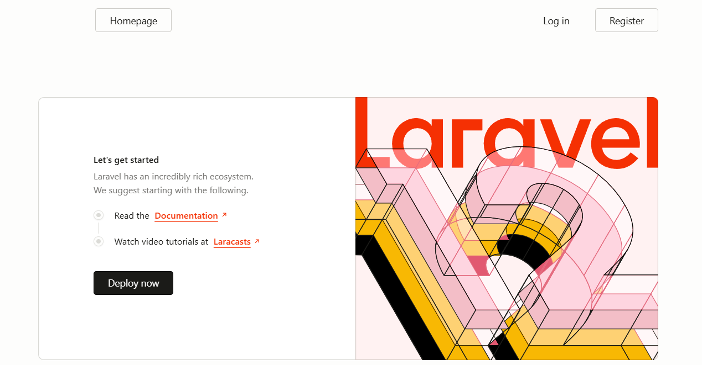
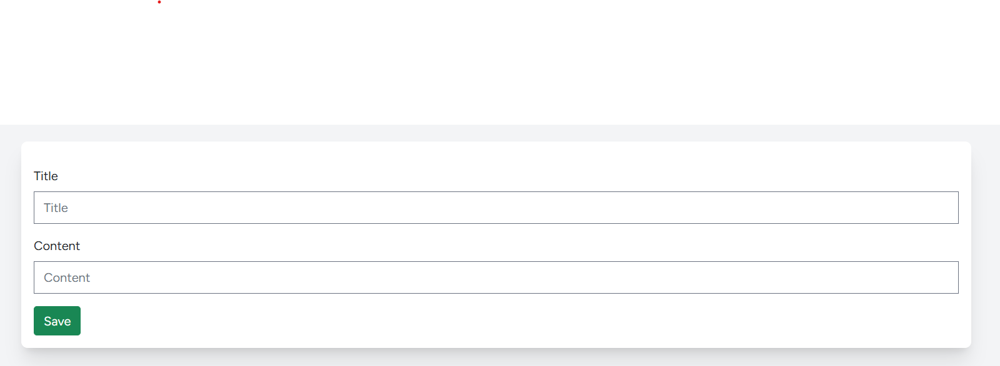
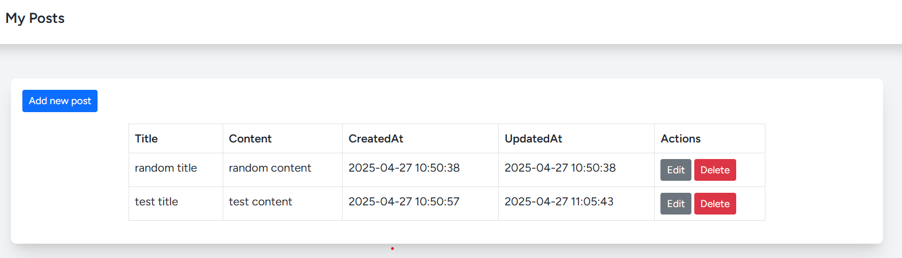
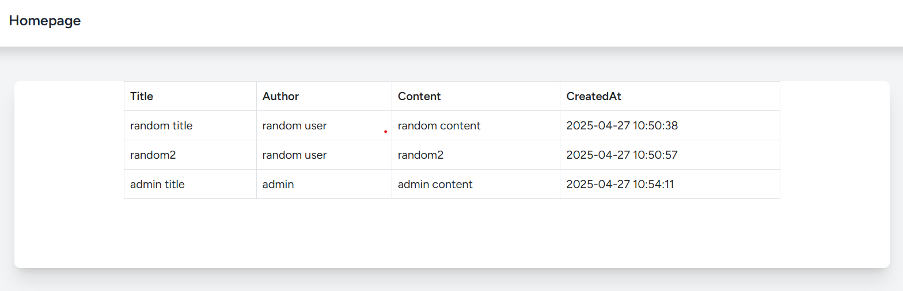
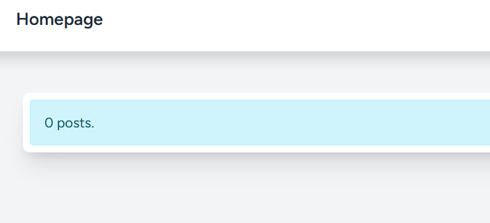
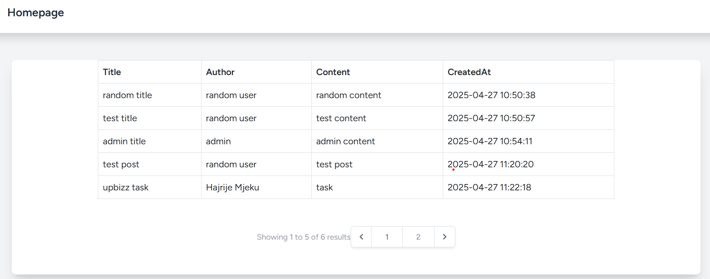

# Laravel CRUD Web Application

📋  **Project Description**
This is a simple Laravel CRUD web application developed for a technical challenge.
It allows authenticated users to create, view, and delete their own posts, with user-specific access control and pagination.
Authentication and basic user management are handled by Laravel Jetstream.

📸  **Screenshots of the Application**
1. Landing Page
    * The first screen shown when the user visits the application:
    
2. Create Post Page
    * A form for creating a new post:
    
3. My Posts Page
    * The page that shows the user's own posts:
    
4. Delete Alert
    * An alert showing when the user is about to delete a post:
    
5. All Posts Page
    * A page listing all posts from all users:
    
6. No Posts Case
    * What happens if no posts are available:
    
7. Pagination
    * Shows how posts are paginated, with 5 posts per page:
    

🚀  **Features**
* User registration, login, logout (Laravel Jetstream authentication)
* Create, view, update and delete posts from auth users
* Only post owners can update and delete their own posts
* Homepage listing posts from all users, regardless of whether the user is logged in or not
* Posts page listing a user's own posts
* Pagination (5 posts per page)

🛠️  **Technologies Used**
* PHP 8+
* Laravel Jetstream (with Livewire)
* Bootstrap CSS
* MySQL
* Composer
* NPM

⚙️  **Installation and Setup Instructions**
1. Clone the repository
    * git clone [https://github.com/hajrijemjeku/crudlaravel]
    * cd crudlaravel
2. Install PHP dependencies:
    * composer install
3. Install frontend assets:
    * npm install && npm run dev
4. Create a copy of .env:
    * cp .env.example .env
**4.1.** Update the .env file:
    ** This project uses MySQL, not SQLite. After copying the file, open .env and make sure the database settings look like this:
        `DB_CONNECTION=mysql
        DB_HOST=127.0.0.1
        DB_PORT=3306
        DB_DATABASE=your_database_name  # e.g. crudlaravel
        DB_USERNAME=your_username
        DB_PASSWORD=your_password`
5. Generate application key:
    * php artisan key:generate
6. Run database migrations:
    * php artisan migrate
7. Start the local development server:
    * php artisan serve

📚  **Project Structure**
* Authentication is handled by Laravel Jetstream
* Post model contains title, content, created_at and updated_at.
* Authorization ensures only owners can update or delete their posts.
* Posts page: /posts lists a user's posts.
* Homepage: Lists all posts with pagination.
* Pagination: 5 posts per page.

🏆  **Bonus Features**
* Timestamps shown on posts (created_at, updated_at)
* UI styled with Bootstrap CSS

👀  **Usage**
* Once the server is running, visit `http://localhost:8000` in your browser.
* You can register as a new user, create posts, and manage your posts (view, edit, delete).
* Visit `/posts` to see all your posts.
* You can also see other users' posts on the `/homepage`, which lists posts from all users with pagination.

 